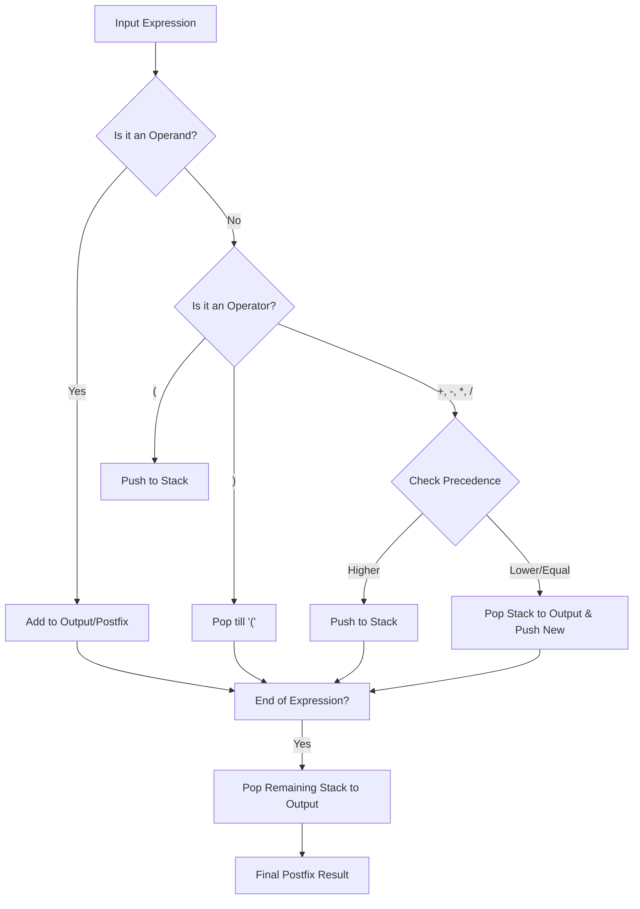

# Expression Evaluator (Infix to Postfix) 🧮

A professional Java desktop application that evaluates mathematical expressions. It utilizes the **Stack** data structure to convert Infix notation into Postfix (Reverse Polish Notation) and computes the final result.

---

## 📸 Interface Showcase

### 1. Complex Expression Handling
The application correctly handles parentheses and multiple operators, showing the step-by-step conversion.


### 2. Multi-digit & Operator Precedence
Demonstrating the system's ability to prioritize operations like multiplication and division over addition.


---

## 🧠 Core Logic & Algorithm
This project is a practical implementation of two major Stack algorithms:

1. **Shunting-Yard Algorithm:** To convert standard expressions (Infix) into a machine-readable format (Postfix).
2. **Postfix Evaluation:** Using a second stack to calculate the result from the converted expression.


### Example Workflow:
* **User Input:** `100 / (2 * 5) + 15`
* **Internal Postfix:** `100 2 5 * / 15 +`
* **Computed Result:** `25.0`

---



## ✨ Features
* **Modern Dark UI:** Clean aesthetic for a professional look.
* **Error Validation:** Detects and reports invalid mathematical expressions.
* **Multi-digit Support:** Efficiently parses numbers with multiple digits and decimals.
* **Real-time Feedback:** Shows both the postfix string and the result instantly.

## 🛠️ Technical Stack
* **Language:** Java
* **UI Framework:** Java Swing / AWT (GUI)
* **Data Structure:** Stack (Last-In-First-Out logic)

### ⚙️ How to Setup & Run

1. **Clone the Repo:**
   ```bash
 git clone https://github.com/bushra-waseem/Java-Expression-Evaluator-GUI.git
 Import the project into IntelliJ IDEA, Eclipse, or NetBeans.
 Run the main Java file to launch the GUI window.
```

### 🤝 Connect with Me
* **LinkedIn:** [Bushra Waseem](APNA_LINKEDIN_URL_YAHAN_DALAIN)
